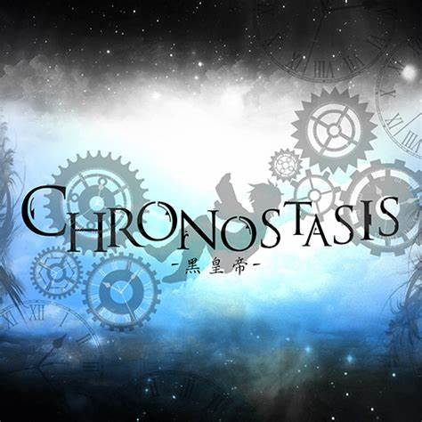
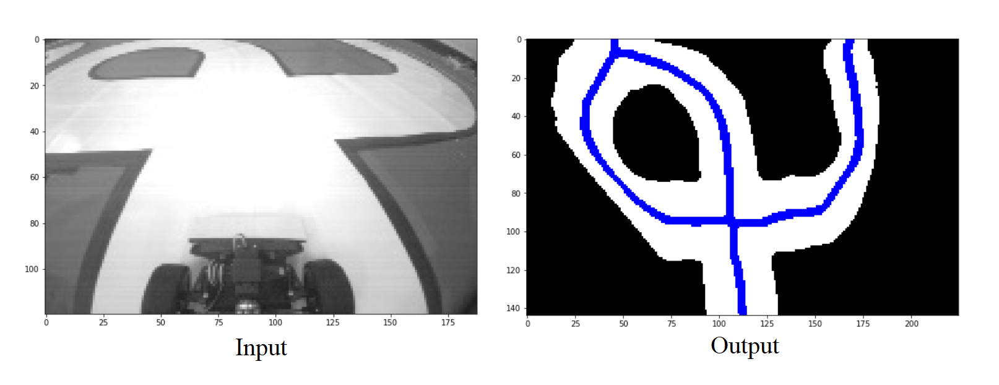

# Chronostasis

*A harmony of Light awaits you in a lost world of musical Conflict.*

Detects the center of the path from a 188x120 wide-angle camera.

This program processes the input within a few seconds on a regular computer with a Python environment. It regardless requires abundant loops and therefore fails to gain a high performance, but will receive well performance results with a pure C implementation.

This program requires at most 530kb memory, with good optimization.

Currently command line environment results in unexpected stack overflows, therefore we suggest using Jupyter Lab to execute the code.

We are open and welcome to C or C++ implementations of this program.
